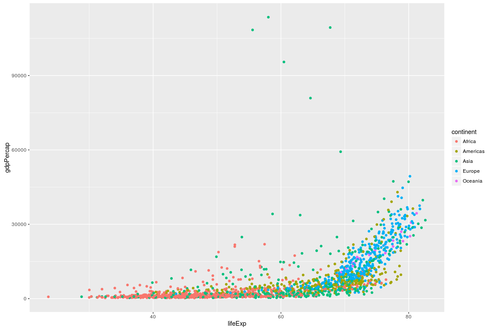
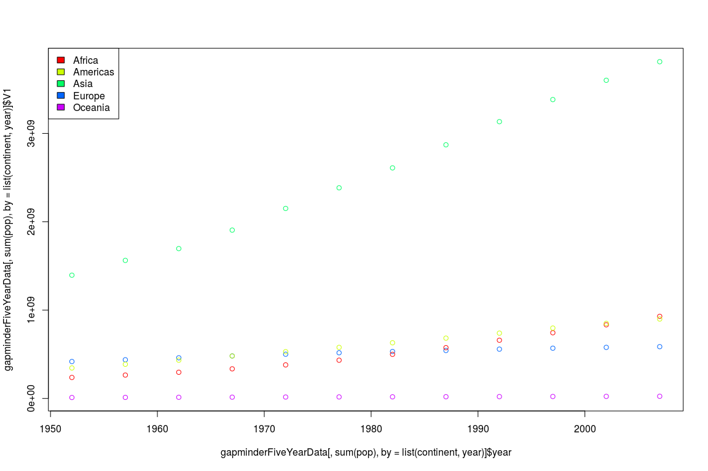

# Stuff You Should Know About: Handling Large Data Files with R
## The Data Table package and various other ways to handle data in R

 - **Authors**: Tom Kelly
- **Research field**: Bioinformatics / Computational Biology / Cancer Genomics
 - **Lesson Topic**: An introduction to various packages for file I/O and data manipulation in R, with comparision to base R (and compatibility with data frames), in terms of user-friendliness, performance in CPU-time, and memory usage. 

## Installation

Install Data Table from CRAN (current version 1.9.6)

```r
install.packages("data.table", repos = "https::/cran.rstudio.com")
library("data.table")
```

Install development version from GitHub (current version 1.9.7)

```r
install.packages("data.table", repos = "https://Rdatatable.github.io/data.table", type = "source") #v1.9.7
```

```
## 
## The downloaded source packages are in
## 	'/tmp/Rtmp3U0YQL/downloaded_packages'
```

```r
library("data.table")
```

## Getting Started: Data Frames

data table has it's own read function - to rapidly read data into R
Backwards compatible: It can be used for data.frames

```r
gapminderFiveYearData <- fread("gapminder-FiveYearData.csv", data.table=F)
class(gapminderFiveYearData)
```

```
## [1] "data.frame"
```

```r
dim(gapminderFiveYearData)
```

```
## [1] 1704    6
```

```r
head(gapminderFiveYearData)
```

```
##       country year      pop continent lifeExp gdpPercap
## 1 Afghanistan 1952  8425333      Asia  28.801  779.4453
## 2 Afghanistan 1957  9240934      Asia  30.332  820.8530
## 3 Afghanistan 1962 10267083      Asia  31.997  853.1007
## 4 Afghanistan 1967 11537966      Asia  34.020  836.1971
## 5 Afghanistan 1972 13079460      Asia  36.088  739.9811
## 6 Afghanistan 1977 14880372      Asia  38.438  786.1134
```

```r
tail(gapminderFiveYearData)
```

```
##       country year      pop continent lifeExp gdpPercap
## 1699 Zimbabwe 1982  7636524    Africa  60.363  788.8550
## 1700 Zimbabwe 1987  9216418    Africa  62.351  706.1573
## 1701 Zimbabwe 1992 10704340    Africa  60.377  693.4208
## 1702 Zimbabwe 1997 11404948    Africa  46.809  792.4500
## 1703 Zimbabwe 2002 11926563    Africa  39.989  672.0386
## 1704 Zimbabwe 2007 12311143    Africa  43.487  469.7093
```

```r
str(gapminderFiveYearData)
```

```
## 'data.frame':	1704 obs. of  6 variables:
##  $ country  : chr  "Afghanistan" "Afghanistan" "Afghanistan" "Afghanistan" ...
##  $ year     : int  1952 1957 1962 1967 1972 1977 1982 1987 1992 1997 ...
##  $ pop      : num  8425333 9240934 10267083 11537966 13079460 ...
##  $ continent: chr  "Asia" "Asia" "Asia" "Asia" ...
##  $ lifeExp  : num  28.8 30.3 32 34 36.1 ...
##  $ gdpPercap: num  779 821 853 836 740 ...
```

Backwards compatible: these are standard dataframes compatible with ggplots

```r
library("ggplot2")
ggplot(data = gapminderFiveYearData, aes(x = lifeExp, y = gdpPercap, color=continent)) +
  geom_point()
```

\

##Introducing Data Tables

data table defaults to reading it's own data.table format

```r
gapminderFiveYearData <- fread("gapminder-FiveYearData.csv")
class(gapminderFiveYearData)
```

```
## [1] "data.table" "data.frame"
```

```r
dim(gapminderFiveYearData)
```

```
## [1] 1704    6
```

```r
head(gapminderFiveYearData)
```

```
##        country year      pop continent lifeExp gdpPercap
## 1: Afghanistan 1952  8425333      Asia  28.801  779.4453
## 2: Afghanistan 1957  9240934      Asia  30.332  820.8530
## 3: Afghanistan 1962 10267083      Asia  31.997  853.1007
## 4: Afghanistan 1967 11537966      Asia  34.020  836.1971
## 5: Afghanistan 1972 13079460      Asia  36.088  739.9811
## 6: Afghanistan 1977 14880372      Asia  38.438  786.1134
```

```r
tail(gapminderFiveYearData)
```

```
##     country year      pop continent lifeExp gdpPercap
## 1: Zimbabwe 1982  7636524    Africa  60.363  788.8550
## 2: Zimbabwe 1987  9216418    Africa  62.351  706.1573
## 3: Zimbabwe 1992 10704340    Africa  60.377  693.4208
## 4: Zimbabwe 1997 11404948    Africa  46.809  792.4500
## 5: Zimbabwe 2002 11926563    Africa  39.989  672.0386
## 6: Zimbabwe 2007 12311143    Africa  43.487  469.7093
```

```r
str(gapminderFiveYearData)
```

```
## Classes 'data.table' and 'data.frame':	1704 obs. of  6 variables:
##  $ country  : chr  "Afghanistan" "Afghanistan" "Afghanistan" "Afghanistan" ...
##  $ year     : int  1952 1957 1962 1967 1972 1977 1982 1987 1992 1997 ...
##  $ pop      : num  8425333 9240934 10267083 11537966 13079460 ...
##  $ continent: chr  "Asia" "Asia" "Asia" "Asia" ...
##  $ lifeExp  : num  28.8 30.3 32 34 36.1 ...
##  $ gdpPercap: num  779 821 853 836 740 ...
##  - attr(*, ".internal.selfref")=<externalptr>
```
Data tables also auto-trim when printing to console

```r
gapminderFiveYearData
```

```
##           country year      pop continent lifeExp gdpPercap
##    1: Afghanistan 1952  8425333      Asia  28.801  779.4453
##    2: Afghanistan 1957  9240934      Asia  30.332  820.8530
##    3: Afghanistan 1962 10267083      Asia  31.997  853.1007
##    4: Afghanistan 1967 11537966      Asia  34.020  836.1971
##    5: Afghanistan 1972 13079460      Asia  36.088  739.9811
##   ---                                                      
## 1700:    Zimbabwe 1987  9216418    Africa  62.351  706.1573
## 1701:    Zimbabwe 1992 10704340    Africa  60.377  693.4208
## 1702:    Zimbabwe 1997 11404948    Africa  46.809  792.4500
## 1703:    Zimbabwe 2002 11926563    Africa  39.989  672.0386
## 1704:    Zimbabwe 2007 12311143    Africa  43.487  469.7093
```

data tables are backwards compatible with a lot of operations which use data.frames
Such as plots...

```r
ggplot(data = gapminderFiveYearData, aes(x = lifeExp, y = gdpPercap, color=continent)) +
  geom_point()
```

\
... and linear models...

```r
linear_model <- lm(gdpPercap ~ pop + year, gapminderFiveYearData)
summary(linear_model)
```

```
## 
## Call:
## lm(formula = gdpPercap ~ pop + year, data = gapminderFiveYearData)
## 
## Residuals:
##    Min     1Q Median     3Q    Max 
## -10537  -5356  -2811   2043 109153 
## 
## Coefficients:
##               Estimate Std. Error t value Pr(>|t|)    
## (Intercept) -2.537e+05  2.674e+04  -9.487   <2e-16 ***
## pop         -4.143e-06  2.198e-06  -1.885   0.0596 .  
## year         1.319e+02  1.351e+01   9.760   <2e-16 ***
## ---
## Signif. codes:  0 '***' 0.001 '**' 0.01 '*' 0.05 '.' 0.1 ' ' 1
## 
## Residual standard error: 9595 on 1701 degrees of freedom
## Multiple R-squared:  0.05365,	Adjusted R-squared:  0.05254 
## F-statistic: 48.22 on 2 and 1701 DF,  p-value: < 2.2e-16
```

```r
linear_model <- lm(lifeExp ~ gdpPercap + pop + year, gapminderFiveYearData)
summary(linear_model)
```

```
## 
## Call:
## lm(formula = lifeExp ~ gdpPercap + pop + year, data = gapminderFiveYearData)
## 
## Residuals:
##     Min      1Q  Median      3Q     Max 
## -67.497  -7.075   1.121   7.701  19.640 
## 
## Coefficients:
##               Estimate Std. Error t value Pr(>|t|)    
## (Intercept) -4.115e+02  2.767e+01 -14.872  < 2e-16 ***
## gdpPercap    6.729e-04  2.444e-05  27.529  < 2e-16 ***
## pop          6.353e-09  2.218e-09   2.864  0.00423 ** 
## year         2.354e-01  1.400e-02  16.812  < 2e-16 ***
## ---
## Signif. codes:  0 '***' 0.001 '**' 0.01 '*' 0.05 '.' 0.1 ' ' 1
## 
## Residual standard error: 9.673 on 1700 degrees of freedom
## Multiple R-squared:  0.4402,	Adjusted R-squared:  0.4392 
## F-statistic: 445.6 on 3 and 1700 DF,  p-value: < 2.2e-16
```

```r
linear_model <- glm(lifeExp ~ gdpPercap + continent + pop + year, family  ="gaussian", gapminderFiveYearData)
summary(linear_model)
```

```
## 
## Call:
## glm(formula = lifeExp ~ gdpPercap + continent + pop + year, family = "gaussian", 
##     data = gapminderFiveYearData)
## 
## Deviance Residuals: 
##      Min        1Q    Median        3Q       Max  
## -28.4051   -4.0550    0.2317    4.5073   20.0217  
## 
## Coefficients:
##                     Estimate Std. Error t value Pr(>|t|)    
## (Intercept)       -5.185e+02  1.989e+01 -26.062   <2e-16 ***
## gdpPercap          2.985e-04  2.002e-05  14.908   <2e-16 ***
## continentAmericas  1.429e+01  4.946e-01  28.898   <2e-16 ***
## continentAsia      9.375e+00  4.719e-01  19.869   <2e-16 ***
## continentEurope    1.936e+01  5.182e-01  37.361   <2e-16 ***
## continentOceania   2.056e+01  1.469e+00  13.995   <2e-16 ***
## pop                1.791e-09  1.634e-09   1.096    0.273    
## year               2.863e-01  1.006e-02  28.469   <2e-16 ***
## ---
## Signif. codes:  0 '***' 0.001 '**' 0.01 '*' 0.05 '.' 0.1 ' ' 1
## 
## (Dispersion parameter for gaussian family taken to be 47.37935)
## 
##     Null deviance: 284148  on 1703  degrees of freedom
## Residual deviance:  80355  on 1696  degrees of freedom
## AIC: 11420
## 
## Number of Fisher Scoring iterations: 2
```
... and data manipulation packages (plyr, dplyr, reshape, tidyr, etc...)

```r
library("plyr")
calcGDP <- function(dat, year=NULL, country=NULL) {
  if(!is.null(year)) {
    dat <- dat[dat$year %in% year, ]
  }
  if (!is.null(country)) {
    dat <- dat[dat$country %in% country,]
  }
  gdp <- dat$pop * dat$gdpPercap
  
  new <- cbind(dat, gdp=gdp)
  return(new)
}
plyr::ddply(
  .data = calcGDP(gapminderFiveYearData),
  .variables = "continent",
  .fun = function(x) mean(x$gdp)
)
```

```
##   continent           V1
## 1    Africa  20904782844
## 2  Americas 379262350210
## 3      Asia 227233738153
## 4    Europe 269442085301
## 5   Oceania 188187105354
```
Yeah you get the idea.

Data tables have built-in "methods" for a range of functions, these are often faster than standard dataframes or matrices, if these aren't found it uses dataframe functions. A "Data Table" is compatible with any function from any package designed for a "Data Frame".


## File I/O (Input/Output)
fread is "fast read", and it's **fast**, even for large data files. Let's try it out on some larger datafiles:

```r
gapminderlarge <- fread("gapminder-large.csv", header=T)
```
fread is smart, it auto detects column classes, separators, headers, nrows (for a regularly separated file). We can use the same comand for a whole bunch of file formats. All the usual reading options can be specified manually...

```r
gapminderFiveYearData <- fread("gapminder-FiveYearData.tsv") #tab delimited
gapminderFiveYearData <- fread("gapminder-FiveYearData.txt") #space delimited
gapminderFiveYearDataCrop <- fread("gapminder-FiveYearData.tsv", header=T, col.names=c("place", "time", "people", "big place", "life", "money"), nrows=1000, stringsAsFactors=F)
gapminderFiveYearDataCrop
```

```
##             place time    people big place   life      money
##    1: Afghanistan 1952   8425333      Asia 28.801   779.4453
##    2: Afghanistan 1957   9240934      Asia 30.332   820.8530
##    3: Afghanistan 1962  10267083      Asia 31.997   853.1007
##    4: Afghanistan 1967  11537966      Asia 34.020   836.1971
##    5: Afghanistan 1972  13079460      Asia 36.088   739.9811
##   ---                                                       
##  996:      Mexico 2007 108700891  Americas 76.195 11977.5750
##  997:    Mongolia 1952    800663      Asia 42.244   786.5669
##  998:    Mongolia 1957    882134      Asia 45.248   912.6626
##  999:    Mongolia 1962   1010280      Asia 48.251  1056.3540
## 1000:    Mongolia 1967   1149500      Asia 51.253  1226.0411
```
...but it does a lot of the tedious work for you (pretty well too).

It's also got cool progress bars for large files :) These kick in automatically if the file takes longer than about a second. This is really handy to know your code is working, and how long it will take.

```r
gapminderlarger <- fread("gapminder-larger.csv")
```

```
## 
Read 42.4% of 6625152 rows
Read 70.5% of 6625152 rows
Read 98.6% of 6625152 rows
Read 6625152 rows and 6 (of 6) columns from 0.321 GB file in 00:00:05
```
It's so fast it tells you. Let's compare that with base R:

```r
system.time(gapminderlarger.dataframe <- read.csv("gapminder-larger.csv", header=T))
```

```
##    user  system elapsed 
##  22.088   0.556  22.668
```
The same operation took much longer with base R, with larger files (or repeating this many times) that ~6x difference could mean a lot for your workflow. 

FYI - there's also a "fast write" compatible with several file formats

```r
fwrite(gapminderlarger, file="test.csv") #defaults to csv
fwrite(gapminderlarger, file="test.tsv", sep="\t")
```
They're also fast to write data, compared to base R:

```r
system.time(fwrite(gapminderlarger, file="test.csv"))
```

```
##    user  system elapsed 
##  17.724   0.404  20.595
```

```r
system.time(write.csv(gapminderlarger, file="test.csv"))
```

```
##    user  system elapsed 
##  39.436   0.416  41.475
```

## readr (Hadley Wickham and RStudio)
Another package enables faster alternatives to existing read functions in base R: these work almost exactly the same as their base R counterparts.

 | **base R** | **readr**
--- | --- | ---
spaced file | `read.table`   | `read_table`
fixed-width file | `read.fwf`   | `read_fwf`
comma-separated file | `read.csv`   | `read_csv`
semicolon-separated file | `read.csv2`   | `read_csv2`
tab-delimited file | `read.table`   | `read_tsv`
comma-separated file | `read.csv`   | `read_csv`
file or string `readLines`   | `read_lines` or `read_file`

Let's try it out on a space-delimited file:

```r
library("readr")
system.time(read_table("gapminder-FiveYearData.txt"))
```

```
##    user  system elapsed 
##   0.020   0.004   0.272
```

```r
system.time(read.table("gapminder-FiveYearData.txt"))
```

```
##    user  system elapsed 
##   0.012   0.000   0.012
```
Even on a small file `readr` is faster than base R. This also holds for larger csv files:

```r
system.time(read_csv("gapminder-larger.csv"))
```

```
##    user  system elapsed 
##   4.232   0.036   4.274
```

```r
system.time(read.csv("gapminder-larger.csv"))
```

```
##    user  system elapsed 
##  22.132   0.228  22.385
```
`readr` also has a handy progress bar allowign us to monitor progress. There is an equivalent `readxl` package with a `read_excel` function compatible with xls or xlsx files and enables sheet selection. This is a relatively new alternative to the `xlsx` package and it's `read.xlsx` function which are difficult to work with (as it is java and perl dependent).

## Another solution: bigmemory

```r
library("bigmemory")
```
"bigmemory" uses the "big.matrix" format to access large data files in a C++ framework - rather than stored in RAM/memory as usual in R. This is handy for handling **very large** files, when loading the full dataset in working environment (RAM memory) slows your computer to a halt. Might be handy on servers / HPC too but usually they have enough memory if you're willing to wait for it in a queue.

Let's try out bigmemory, first we convert an R data matrix into a "big.matrix":

```r
gapminderFiveYearData.big <- as.big.matrix(gapminderFiveYearData)
gapminderFiveYearData.big
```

```
## An object of class "big.matrix"
## Slot "address":
## <pointer: 0x154ec0a0>
```

```r
class(gapminderFiveYearData.big)
```

```
## [1] "big.matrix"
## attr(,"package")
## [1] "bigmemory"
```

```r
dim(gapminderFiveYearData.big)
```

```
## [1] 1704    6
```

```r
head(gapminderFiveYearData.big)
```

```
##   country year      pop continent lifeExp gdpPercap
## 1       1 1952  8425333         3  28.801  779.4453
## 2       1 1957  9240934         3  30.332  820.8530
## 3       1 1962 10267083         3  31.997  853.1007
## 4       1 1967 11537966         3  34.020  836.1971
## 5       1 1972 13079460         3  36.088  739.9811
## 6       1 1977 14880372         3  38.438  786.1134
```

```r
tail(gapminderFiveYearData.big)
```

```
##      country year      pop continent lifeExp gdpPercap
## 1699     142 1982  7636524         1  60.363  788.8550
## 1700     142 1987  9216418         1  62.351  706.1573
## 1701     142 1992 10704340         1  60.377  693.4208
## 1702     142 1997 11404948         1  46.809  792.4500
## 1703     142 2002 11926563         1  39.989  672.0386
## 1704     142 2007 12311143         1  43.487  469.7093
```

```r
str(gapminderFiveYearData.big)
```

```
## Formal class 'big.matrix' [package "bigmemory"] with 1 slot
##   ..@ address:<externalptr>
```
bigmemory, also has read/write functions direct to big.matrix format:

```r
write.big.matrix(gapminderFiveYearData.big, "test.csv")
gapminderFiveYearData.big <- read.big.matrix("test.csv")
```
These are designed to be efficient for memory - how fast are they?

```r
system.time(gapminderlarger.big <- read.big.matrix("gapminder-larger.csv"))
```

```
##    user  system elapsed 
##  12.892   0.204  13.112
```

```r
system.time(write.big.matrix(gapminderFiveYearData.big, "test.csv"))
```

```
##    user  system elapsed 
##   0.008   0.004   0.013
```

## New and Shiny: FEATHER
### A Fast On-Disk Format for Data Frames for R and Python, powered by Apache Arrow

FEATHER (is it's own fast file format) - from Hadley Wickham ggplot/dplyr/etc... and Wes Mckinney (pandas in Python)
Note: it's in development (unstable) - future versions may not read past versions - intended for use to transfer files quickly (e.g., between R and Python)

At the moment you can only try it out from their github repo (in R or python), it will no doubt end up on CRAN very soon:

```r
library("devtools")
devtools::install_github("wesm/feather/R")
library(feather)
```

FEATHER has it's own file I/O commands (and format):

```r
path <- "gapminder-FiveYearData.feather"
write_feather(gapminderFiveYearData, path) #write data frame to file
gapminderFiveYearData <- read_feather(path) #read to data frame
gapminderFiveYearData
```

```
## Source: local data frame [1,704 x 6]
## 
##        country  year      pop continent lifeExp gdpPercap
##          <chr> <int>    <dbl>     <chr>   <dbl>     <dbl>
## 1  Afghanistan  1952  8425333      Asia  28.801  779.4453
## 2  Afghanistan  1957  9240934      Asia  30.332  820.8530
## 3  Afghanistan  1962 10267083      Asia  31.997  853.1007
## 4  Afghanistan  1967 11537966      Asia  34.020  836.1971
## 5  Afghanistan  1972 13079460      Asia  36.088  739.9811
## 6  Afghanistan  1977 14880372      Asia  38.438  786.1134
## 7  Afghanistan  1982 12881816      Asia  39.854  978.0114
## 8  Afghanistan  1987 13867957      Asia  40.822  852.3959
## 9  Afghanistan  1992 16317921      Asia  41.674  649.3414
## 10 Afghanistan  1997 22227415      Asia  41.763  635.3414
## ..         ...   ...      ...       ...     ...       ...
```
Did I mention it's crazy fast?

```r
path <- "gapminderlarger.feather"
system.time(write_feather(gapminderlarger, path))
```

```
##    user  system elapsed 
##   0.324   0.200   1.404
```

```r
system.time(gapminderlarger.feather <- read_feather(path))
```

```
##    user  system elapsed 
##   0.344   0.012   0.358
```

Or install and run in Python:
```
import feather
path = 'my_data.feather'
feather.write_dataframe(df, path)
df = feather.read_dataframe(path)
```

Note that FEATHER is designed for data _already_ loaded into python or R.

## FILE I/O Summary

### READ 
**base R** | **data table** | **readr** | **bigmemory** | **feather**
--- | --- | --- | ---
`read.csv`   | `fread`         | `read_csv` | `read.big.matrix` | `read_feather`
52.203s | 8.154s | 11.120s | 28.647s | 2.414s

### Convert dataframe to format 
**base R** | **data table** | **bigmemory** | **feather**
--- | --- | --- | ---
`data.frame` | `as.data.table` | `as.big.matrix`   | built-in
NA | 0.002s | 66.07s | NA

### Write 
**base R** | **data table** | **bigmemory** | **feather**
--- | --- | --- | ---
`write.csv`  | `fwrite`       | `write.big.matrix` | `write_feather`
71.382s | 35.453s | 0.068ss | 5.008s

##Manipulating Data Tables

```r
gapminderFiveYearData <- fread("gapminder-FiveYearData.csv", data.table=T, header = T)
class(gapminderFiveYearData)
```

```
## [1] "data.table" "data.frame"
```
We can simply treat it as a data frame in many cases:

```r
gapminderFiveYearData[1,]
```

```
##        country year     pop continent lifeExp gdpPercap
## 1: Afghanistan 1952 8425333      Asia  28.801  779.4453
```

```r
colnames(gapminderFiveYearData)
```

```
## [1] "country"   "year"      "pop"       "continent" "lifeExp"   "gdpPercap"
```

```r
head(gapminderFiveYearData$country)
```

```
## [1] "Afghanistan" "Afghanistan" "Afghanistan" "Afghanistan" "Afghanistan"
## [6] "Afghanistan"
```

```r
tail(gapminderFiveYearData$country)
```

```
## [1] "Zimbabwe" "Zimbabwe" "Zimbabwe" "Zimbabwe" "Zimbabwe" "Zimbabwe"
```
Data Table has a "Natural" Syntax

`DT[where, select|update|do, by]`

...although suspiciously similar to SQL?

it allows chaining queries: `DT[][]`

Formally: we subset a datatable, Dt, with `DT[i, j, by]`

###I: row selection

```r
gapminderFiveYearData[c(1:5, 100:105),] #by number
```

```
##         country year       pop continent lifeExp gdpPercap
##  1: Afghanistan 1952   8425333      Asia  28.801  779.4453
##  2: Afghanistan 1957   9240934      Asia  30.332  820.8530
##  3: Afghanistan 1962  10267083      Asia  31.997  853.1007
##  4: Afghanistan 1967  11537966      Asia  34.020  836.1971
##  5: Afghanistan 1972  13079460      Asia  36.088  739.9811
##  6:  Bangladesh 1967  62821884      Asia  43.453  721.1861
##  7:  Bangladesh 1972  70759295      Asia  45.252  630.2336
##  8:  Bangladesh 1977  80428306      Asia  46.923  659.8772
##  9:  Bangladesh 1982  93074406      Asia  50.009  676.9819
## 10:  Bangladesh 1987 103764241      Asia  52.819  751.9794
## 11:  Bangladesh 1992 113704579      Asia  56.018  837.8102
```

```r
gapminderFiveYearData[gapminderFiveYearData$country=="New Zealand",] #by condition
```

```
##         country year     pop continent lifeExp gdpPercap
##  1: New Zealand 1952 1994794   Oceania  69.390  10556.58
##  2: New Zealand 1957 2229407   Oceania  70.260  12247.40
##  3: New Zealand 1962 2488550   Oceania  71.240  13175.68
##  4: New Zealand 1967 2728150   Oceania  71.520  14463.92
##  5: New Zealand 1972 2929100   Oceania  71.890  16046.04
##  6: New Zealand 1977 3164900   Oceania  72.220  16233.72
##  7: New Zealand 1982 3210650   Oceania  73.840  17632.41
##  8: New Zealand 1987 3317166   Oceania  74.320  19007.19
##  9: New Zealand 1992 3437674   Oceania  76.330  18363.32
## 10: New Zealand 1997 3676187   Oceania  77.550  21050.41
## 11: New Zealand 2002 3908037   Oceania  79.110  23189.80
## 12: New Zealand 2007 4115771   Oceania  80.204  25185.01
```

```r
gapminderFiveYearData[gapminderFiveYearData$country %in% c("New Zealand", "Australia", "Japan"),] #by condition
```

```
##         country year       pop continent lifeExp gdpPercap
##  1:   Australia 1952   8691212   Oceania  69.120 10039.596
##  2:   Australia 1957   9712569   Oceania  70.330 10949.650
##  3:   Australia 1962  10794968   Oceania  70.930 12217.227
##  4:   Australia 1967  11872264   Oceania  71.100 14526.125
##  5:   Australia 1972  13177000   Oceania  71.930 16788.629
##  6:   Australia 1977  14074100   Oceania  73.490 18334.198
##  7:   Australia 1982  15184200   Oceania  74.740 19477.009
##  8:   Australia 1987  16257249   Oceania  76.320 21888.889
##  9:   Australia 1992  17481977   Oceania  77.560 23424.767
## 10:   Australia 1997  18565243   Oceania  78.830 26997.937
## 11:   Australia 2002  19546792   Oceania  80.370 30687.755
## 12:   Australia 2007  20434176   Oceania  81.235 34435.367
## 13:       Japan 1952  86459025      Asia  63.030  3216.956
## 14:       Japan 1957  91563009      Asia  65.500  4317.694
## 15:       Japan 1962  95831757      Asia  68.730  6576.649
## 16:       Japan 1967 100825279      Asia  71.430  9847.789
## 17:       Japan 1972 107188273      Asia  73.420 14778.786
## 18:       Japan 1977 113872473      Asia  75.380 16610.377
## 19:       Japan 1982 118454974      Asia  77.110 19384.106
## 20:       Japan 1987 122091325      Asia  78.670 22375.942
## 21:       Japan 1992 124329269      Asia  79.360 26824.895
## 22:       Japan 1997 125956499      Asia  80.690 28816.585
## 23:       Japan 2002 127065841      Asia  82.000 28604.592
## 24:       Japan 2007 127467972      Asia  82.603 31656.068
## 25: New Zealand 1952   1994794   Oceania  69.390 10556.576
## 26: New Zealand 1957   2229407   Oceania  70.260 12247.395
## 27: New Zealand 1962   2488550   Oceania  71.240 13175.678
## 28: New Zealand 1967   2728150   Oceania  71.520 14463.919
## 29: New Zealand 1972   2929100   Oceania  71.890 16046.037
## 30: New Zealand 1977   3164900   Oceania  72.220 16233.718
## 31: New Zealand 1982   3210650   Oceania  73.840 17632.410
## 32: New Zealand 1987   3317166   Oceania  74.320 19007.191
## 33: New Zealand 1992   3437674   Oceania  76.330 18363.325
## 34: New Zealand 1997   3676187   Oceania  77.550 21050.414
## 35: New Zealand 2002   3908037   Oceania  79.110 23189.801
## 36: New Zealand 2007   4115771   Oceania  80.204 25185.009
##         country year       pop continent lifeExp gdpPercap
```

```r
gapminderFiveYearData[year=="1952"]
```

```
##                 country year      pop continent lifeExp gdpPercap
##   1:        Afghanistan 1952  8425333      Asia  28.801  779.4453
##   2:            Albania 1952  1282697    Europe  55.230 1601.0561
##   3:            Algeria 1952  9279525    Africa  43.077 2449.0082
##   4:             Angola 1952  4232095    Africa  30.015 3520.6103
##   5:          Argentina 1952 17876956  Americas  62.485 5911.3151
##  ---                                                             
## 138:            Vietnam 1952 26246839      Asia  40.412  605.0665
## 139: West Bank and Gaza 1952  1030585      Asia  43.160 1515.5923
## 140:         Yemen Rep. 1952  4963829      Asia  32.548  781.7176
## 141:             Zambia 1952  2672000    Africa  42.038 1147.3888
## 142:           Zimbabwe 1952  3080907    Africa  48.451  406.8841
```

```r
setkey(gapminderFiveYearData, country)
gapminderFiveYearData[c("New Zealand","Australia")] #by key (will be detailed later)
```

```
##         country year      pop continent lifeExp gdpPercap
##  1: New Zealand 1952  1994794   Oceania  69.390  10556.58
##  2: New Zealand 1957  2229407   Oceania  70.260  12247.40
##  3: New Zealand 1962  2488550   Oceania  71.240  13175.68
##  4: New Zealand 1967  2728150   Oceania  71.520  14463.92
##  5: New Zealand 1972  2929100   Oceania  71.890  16046.04
##  6: New Zealand 1977  3164900   Oceania  72.220  16233.72
##  7: New Zealand 1982  3210650   Oceania  73.840  17632.41
##  8: New Zealand 1987  3317166   Oceania  74.320  19007.19
##  9: New Zealand 1992  3437674   Oceania  76.330  18363.32
## 10: New Zealand 1997  3676187   Oceania  77.550  21050.41
## 11: New Zealand 2002  3908037   Oceania  79.110  23189.80
## 12: New Zealand 2007  4115771   Oceania  80.204  25185.01
## 13:   Australia 1952  8691212   Oceania  69.120  10039.60
## 14:   Australia 1957  9712569   Oceania  70.330  10949.65
## 15:   Australia 1962 10794968   Oceania  70.930  12217.23
## 16:   Australia 1967 11872264   Oceania  71.100  14526.12
## 17:   Australia 1972 13177000   Oceania  71.930  16788.63
## 18:   Australia 1977 14074100   Oceania  73.490  18334.20
## 19:   Australia 1982 15184200   Oceania  74.740  19477.01
## 20:   Australia 1987 16257249   Oceania  76.320  21888.89
## 21:   Australia 1992 17481977   Oceania  77.560  23424.77
## 22:   Australia 1997 18565243   Oceania  78.830  26997.94
## 23:   Australia 2002 19546792   Oceania  80.370  30687.75
## 24:   Australia 2007 20434176   Oceania  81.235  34435.37
##         country year      pop continent lifeExp gdpPercap
```
###J: column selection

```r
head(gapminderFiveYearData[,"country"]) #by names
```

```
## [1] "country"
```

```r
head(gapminderFiveYearData[,country]) #by column
```

```
## [1] "Afghanistan" "Afghanistan" "Afghanistan" "Afghanistan" "Afghanistan"
## [6] "Afghanistan"
```

```r
gapminderFiveYearData[,list(country, year, pop)] #by list
```

```
##           country year      pop
##    1: Afghanistan 1952  8425333
##    2: Afghanistan 1957  9240934
##    3: Afghanistan 1962 10267083
##    4: Afghanistan 1967 11537966
##    5: Afghanistan 1972 13079460
##   ---                          
## 1700:    Zimbabwe 1987  9216418
## 1701:    Zimbabwe 1992 10704340
## 1702:    Zimbabwe 1997 11404948
## 1703:    Zimbabwe 2002 11926563
## 1704:    Zimbabwe 2007 12311143
```
This allows operations to be performed on columns:

```r
gapminderFiveYearData[,sum(gdpPercap)] #by colnames
```

```
## [1] 12294917
```

```r
gapminderFiveYearData[,sum(gdpPercap*pop)] #by colnames
```

```
## [1] 3.183235e+14
```

```r
gapminderFiveYearData[,mean(pop)] #by colnames
```

```
## [1] 29601212
```

```r
gapminderFiveYearData[,mean(lifeExp)] #by colnames
```

```
## [1] 59.47444
```
###BY: group operation
This is paricularly power in that we can apply operations to sets values, grouped "by":

```r
gapminderFiveYearData[j=sum(gdpPercap), by=year]
```

```
##     year        V1
##  1: 1952  528989.2
##  2: 1957  610516.0
##  3: 1962  671065.4
##  4: 1967  778678.7
##  5: 1972  961351.8
##  6: 1977 1038469.6
##  7: 1982 1067684.0
##  8: 1987 1121930.7
##  9: 1992 1158522.4
## 10: 1997 1290804.9
## 11: 2002 1408334.5
## 12: 2007 1658570.2
```

```r
gapminderFiveYearData[,sum(gdpPercap), year]
```

```
##     year        V1
##  1: 1952  528989.2
##  2: 1957  610516.0
##  3: 1962  671065.4
##  4: 1967  778678.7
##  5: 1972  961351.8
##  6: 1977 1038469.6
##  7: 1982 1067684.0
##  8: 1987 1121930.7
##  9: 1992 1158522.4
## 10: 1997 1290804.9
## 11: 2002 1408334.5
## 12: 2007 1658570.2
```

```r
gapminderFiveYearData[,mean(lifeExp), year]
```

```
##     year       V1
##  1: 1952 49.05762
##  2: 1957 51.50740
##  3: 1962 53.60925
##  4: 1967 55.67829
##  5: 1972 57.64739
##  6: 1977 59.57016
##  7: 1982 61.53320
##  8: 1987 63.21261
##  9: 1992 64.16034
## 10: 1997 65.01468
## 11: 2002 65.69492
## 12: 2007 67.00742
```

```r
gapminderFiveYearData[,sum(pop), by=list(continent, year)]
```

```
##     continent year         V1
##  1:      Asia 1952 1395357352
##  2:      Asia 1957 1562780599
##  3:      Asia 1962 1696357182
##  4:      Asia 1967 1905662900
##  5:      Asia 1972 2150972248
##  6:      Asia 1977 2384513556
##  7:      Asia 1982 2610135582
##  8:      Asia 1987 2871220762
##  9:      Asia 1992 3133292191
## 10:      Asia 1997 3383285500
## 11:      Asia 2002 3601802203
## 12:      Asia 2007 3811953827
## 13:    Europe 1952  418120846
## 14:    Europe 1957  437890351
## 15:    Europe 1962  460355155
## 16:    Europe 1967  481178958
## 17:    Europe 1972  500635059
## 18:    Europe 1977  517164531
## 19:    Europe 1982  531266901
## 20:    Europe 1987  543094160
## 21:    Europe 1992  558142797
## 22:    Europe 1997  568944148
## 23:    Europe 2002  578223869
## 24:    Europe 2007  586098529
## 25:    Africa 1952  237640501
## 26:    Africa 1957  264837738
## 27:    Africa 1962  296516865
## 28:    Africa 1967  335289489
## 29:    Africa 1972  379879541
## 30:    Africa 1977  433061021
## 31:    Africa 1982  499348587
## 32:    Africa 1987  574834110
## 33:    Africa 1992  659081517
## 34:    Africa 1997  743832984
## 35:    Africa 2002  833723916
## 36:    Africa 2007  929539692
## 37:  Americas 1952  345152446
## 38:  Americas 1957  386953916
## 39:  Americas 1962  433270254
## 40:  Americas 1967  480746623
## 41:  Americas 1972  529384210
## 42:  Americas 1977  578067699
## 43:  Americas 1982  630290920
## 44:  Americas 1987  682753971
## 45:  Americas 1992  739274104
## 46:  Americas 1997  796900410
## 47:  Americas 2002  849772762
## 48:  Americas 2007  898871184
## 49:   Oceania 1952   10686006
## 50:   Oceania 1957   11941976
## 51:   Oceania 1962   13283518
## 52:   Oceania 1967   14600414
## 53:   Oceania 1972   16106100
## 54:   Oceania 1977   17239000
## 55:   Oceania 1982   18394850
## 56:   Oceania 1987   19574415
## 57:   Oceania 1992   20919651
## 58:   Oceania 1997   22241430
## 59:   Oceania 2002   23454829
## 60:   Oceania 2007   24549947
##     continent year         V1
```
As you can see, these results lend well to data we can tabulate or plot:

```r
library("gplots")
plot(gapminderFiveYearData[,sum(pop), by=list(continent, year)]$year,
     gapminderFiveYearData[,sum(pop), by=list(continent, year)]$V1,
     col=rainbow(5)[as.numeric(as.factor(gapminderFiveYearData[,sum(pop), by=list(continent, year)]$continent))])
legend("topleft", fill=rainbow(5), legend=levels(as.factor(gapminderFiveYearData[,sum(pop), by=list(continent, year)]$continent)))
```

\
New and Shiny: by=.EACHI enables more explicit control of the "by" feature. We could manually pull out years or countries we wish to deal with individually:

```r
gapminderFiveYearData[year=="1952" | year=="2002", j=sum(pop), by=year]
```

```
##    year         V1
## 1: 1952 2406957151
## 2: 2002 5886977579
```

```r
gapminderFiveYearData[c("New Zealand","Australia"),sum(gdpPercap*pop)]
```

```
## [1] 4.516491e+12
```

```r
gapminderFiveYearData[c("New Zealand","Australia"),sum(gdpPercap*pop), by=year]
```

```
##     year           V1
##  1: 1952 108314447889
##  2: 1957 133653656027
##  3: 1962 164672906489
##  4: 1967 211917727171
##  5: 1972 268224218455
##  6: 1977 309415422324
##  7: 1982 352354302760
##  8: 1987 418903127997
##  9: 1992 472638359652
## 10: 1997 578608510367
## 11: 2002 690473760353
## 12: 2007 807314089023
```
Notice in both of the above cases the countries are grouped together. Unless specified countries will not be grouped, we can do this either explicitly `by=country` or use the `.EACHI` options for more complex `i` queries:

```r
gapminderFiveYearData[c("New Zealand","Australia"),sum(gdpPercap*pop), by=country]
```

```
##        country           V1
## 1: New Zealand 6.734455e+11
## 2:   Australia 3.843045e+12
```

```r
gapminderFiveYearData[c("New Zealand","Australia"),sum(gdpPercap*pop), by=.EACHI]
```

```
##        country           V1
## 1: New Zealand 6.734455e+11
## 2:   Australia 3.843045e+12
```
Group by multiple arguments explicitly may also give data in a more sensible format:

```r
gapminderFiveYearData[c("New Zealand","Australia"),sum(gdpPercap*pop), by=list(year, country)]
```

```
##     year     country           V1
##  1: 1952 New Zealand  21058193787
##  2: 1957 New Zealand  27304428858
##  3: 1962 New Zealand  32788333487
##  4: 1967 New Zealand  39459740429
##  5: 1972 New Zealand  47000447797
##  6: 1977 New Zealand  51378093149
##  7: 1982 New Zealand  56611498451
##  8: 1987 New Zealand  63050008703
##  9: 1992 New Zealand  63127124700
## 10: 1997 New Zealand  77385257446
## 11: 2002 New Zealand  90626601698
## 12: 2007 New Zealand 103655730130
## 13: 1952   Australia  87256254102
## 14: 1957   Australia 106349227169
## 15: 1962   Australia 131884573002
## 16: 1967   Australia 172457986742
## 17: 1972   Australia 221223770658
## 18: 1977   Australia 258037329175
## 19: 1982   Australia 295742804309
## 20: 1987   Australia 355853119294
## 21: 1992   Australia 409511234952
## 22: 1997   Australia 501223252921
## 23: 2002   Australia 599847158654
## 24: 2007   Australia 703658358894
##     year     country           V1
```
`by=.EACHI` is a little weird, it's an explicit way of restoring a previous version `data.table` functionality. Consider a simple operation of counting the rows returned:

By default data.table counts all rows returned: 

```r
gapminderFiveYearData[c("New Zealand","Australia"), .N]
```

```
## [1] 24
```
To restore previous functionality (an implicit by), `.by=.EACHI` will count the number of rows returned _for each_ i. Basically data.table was really clever and did it for you but some people took issue with a by being performed when it wasn't specified.

```r
gapminderFiveYearData[c("New Zealand","Australia"), .N, by=.EACHI]
```

```
##        country  N
## 1: New Zealand 12
## 2:   Australia 12
```

## Keys
`tables()` shows all tables and their SQL-like "keys", by default to keys are given:

```r
gapminderFiveYearData <- fread("gapminder-FiveYearData.csv")
tables()
```

```
##      NAME                           NROW NCOL  MB
## [1,] gapminderFiveYearData         1,704    6   1
## [2,] gapminderFiveYearDataCrop     1,000    6   1
## [3,] gapminderlarge            1,656,288    6  70
## [4,] gapminderlarger           6,625,152    6 279
##      COLS                                         KEY
## [1,] country,year,pop,continent,lifeExp,gdpPercap    
## [2,] place,time,people,big place,life,money          
## [3,] country,year,pop,continent,lifeExp,gdpPercap    
## [4,] country,year,pop,continent,lifeExp,gdpPercap    
## Total: 351MB
```
We can create a unique identifier as a key:

```r
rowID <- paste(gapminderFiveYearData$country, gapminderFiveYearData$year)
head(rowID)
```

```
## [1] "Afghanistan 1952" "Afghanistan 1957" "Afghanistan 1962"
## [4] "Afghanistan 1967" "Afghanistan 1972" "Afghanistan 1977"
```

```r
tail(head(rowID))
```

```
## [1] "Afghanistan 1952" "Afghanistan 1957" "Afghanistan 1962"
## [4] "Afghanistan 1967" "Afghanistan 1972" "Afghanistan 1977"
```

```r
gapminderFiveYearData$rowID <- rowID
gapminderFiveYearData
```

```
##           country year      pop continent lifeExp gdpPercap
##    1: Afghanistan 1952  8425333      Asia  28.801  779.4453
##    2: Afghanistan 1957  9240934      Asia  30.332  820.8530
##    3: Afghanistan 1962 10267083      Asia  31.997  853.1007
##    4: Afghanistan 1967 11537966      Asia  34.020  836.1971
##    5: Afghanistan 1972 13079460      Asia  36.088  739.9811
##   ---                                                      
## 1700:    Zimbabwe 1987  9216418    Africa  62.351  706.1573
## 1701:    Zimbabwe 1992 10704340    Africa  60.377  693.4208
## 1702:    Zimbabwe 1997 11404948    Africa  46.809  792.4500
## 1703:    Zimbabwe 2002 11926563    Africa  39.989  672.0386
## 1704:    Zimbabwe 2007 12311143    Africa  43.487  469.7093
##                  rowID
##    1: Afghanistan 1952
##    2: Afghanistan 1957
##    3: Afghanistan 1962
##    4: Afghanistan 1967
##    5: Afghanistan 1972
##   ---                 
## 1700:    Zimbabwe 1987
## 1701:    Zimbabwe 1992
## 1702:    Zimbabwe 1997
## 1703:    Zimbabwe 2002
## 1704:    Zimbabwe 2007
```

```r
setkey(gapminderFiveYearData, rowID)
tables()
```

```
##      NAME                           NROW NCOL  MB
## [1,] gapminderFiveYearData         1,704    7   1
## [2,] gapminderFiveYearDataCrop     1,000    6   1
## [3,] gapminderlarge            1,656,288    6  70
## [4,] gapminderlarger           6,625,152    6 279
##      COLS                                               KEY  
## [1,] country,year,pop,continent,lifeExp,gdpPercap,rowID rowID
## [2,] place,time,people,big place,life,money                  
## [3,] country,year,pop,continent,lifeExp,gdpPercap            
## [4,] country,year,pop,continent,lifeExp,gdpPercap            
## Total: 351MB
```
We can search rows `i` for this key:

```r
gapminderFiveYearData["New Zealand 1952",] #search row by key
```

```
##        country year     pop continent lifeExp gdpPercap            rowID
## 1: New Zealand 1952 1994794   Oceania   69.39  10556.58 New Zealand 1952
```
In contrast to dataframes (rownames) duplicate keys are permitted:

```r
setkey(gapminderFiveYearData, country)
gapminderFiveYearData["New Zealand",]
```

```
##         country year     pop continent lifeExp gdpPercap            rowID
##  1: New Zealand 1952 1994794   Oceania  69.390  10556.58 New Zealand 1952
##  2: New Zealand 1957 2229407   Oceania  70.260  12247.40 New Zealand 1957
##  3: New Zealand 1962 2488550   Oceania  71.240  13175.68 New Zealand 1962
##  4: New Zealand 1967 2728150   Oceania  71.520  14463.92 New Zealand 1967
##  5: New Zealand 1972 2929100   Oceania  71.890  16046.04 New Zealand 1972
##  6: New Zealand 1977 3164900   Oceania  72.220  16233.72 New Zealand 1977
##  7: New Zealand 1982 3210650   Oceania  73.840  17632.41 New Zealand 1982
##  8: New Zealand 1987 3317166   Oceania  74.320  19007.19 New Zealand 1987
##  9: New Zealand 1992 3437674   Oceania  76.330  18363.32 New Zealand 1992
## 10: New Zealand 1997 3676187   Oceania  77.550  21050.41 New Zealand 1997
## 11: New Zealand 2002 3908037   Oceania  79.110  23189.80 New Zealand 2002
## 12: New Zealand 2007 4115771   Oceania  80.204  25185.01 New Zealand 2007
```
By default, alls rows are returned for each group (rather than only first for dataframe), the `mult="first"` or `"last"` can modify this:

```r
gapminderFiveYearData["New Zealand", mult="first"] 
```

```
##        country year     pop continent lifeExp gdpPercap            rowID
## 1: New Zealand 1952 1994794   Oceania   69.39  10556.58 New Zealand 1952
```

```r
gapminderFiveYearData["New Zealand", mult="last"] 
```

```
##        country year     pop continent lifeExp gdpPercap            rowID
## 1: New Zealand 2007 4115771   Oceania  80.204  25185.01 New Zealand 2007
```

Queries in data.tables aren't just *easier* they're **faster**

```r
gapminderFiveYearData["New Zealand", mult="first"] 
```

```
##        country year     pop continent lifeExp gdpPercap            rowID
## 1: New Zealand 1952 1994794   Oceania   69.39  10556.58 New Zealand 1952
```

```r
system.time(gapminderFiveYearData["New Zealand", mult="first"]) #time 0.001s
```

```
##    user  system elapsed 
##   0.000   0.000   0.001
```

```r
gapminderFiveYearData.dataframe <- as.data.frame(gapminderFiveYearData)
gapminderFiveYearData.dataframe[gapminderFiveYearData.dataframe$country=="New Zealand",][1,]
```

```
##          country year     pop continent lifeExp gdpPercap            rowID
## 1093 New Zealand 1952 1994794   Oceania   69.39  10556.58 New Zealand 1952
```

```r
system.time(gapminderFiveYearData.dataframe[gapminderFiveYearData.dataframe$country=="New Zealand",][1,])
```

```
##    user  system elapsed 
##       0       0       0
```
Ok, that didn't seem that different. They're powerful with larger datafiles though. Compare these examples for the same operation with dataframes and datatables.

```r
setkey(gapminderlarger, country)
gapminderlarger["New Zealand", mult="first"] 
```

```
##        country year     pop continent lifeExp gdpPercap
## 1: New Zealand 1952 1994794   Oceania   69.39  10556.58
```

```r
system.time(gapminderlarger["New Zealand", mult="first"])
```

```
##    user  system elapsed 
##   0.004   0.000   0.001
```

```r
gapminderlarger.dataframe <- as.data.frame(gapminderlarger)
gapminderlarger.dataframe[gapminderlarger.dataframe$country=="New Zealand",][1,]
```

```
##             country year     pop continent lifeExp gdpPercap
## 4245697 New Zealand 1952 1994794   Oceania   69.39  10556.58
```

```r
system.time(gapminderlarger.dataframe[gapminderlarger.dataframe$country=="New Zealand",][1,])
```

```
##    user  system elapsed 
##   0.228   0.008   0.239
```
Here's an example with multiple keys:

```r
setkey(gapminderlarger, country, year)
gapminderlarger[list("New Zealand", 2007)]
```

```
##           country year     pop continent lifeExp gdpPercap
##    1: New Zealand 2007 4115771   Oceania  80.204  25185.01
##    2: New Zealand 2007 4115771   Oceania  80.204  25185.01
##    3: New Zealand 2007 4115771   Oceania  80.204  25185.01
##    4: New Zealand 2007 4115771   Oceania  80.204  25185.01
##    5: New Zealand 2007 4115771   Oceania  80.204  25185.01
##   ---                                                     
## 3884: New Zealand 2007 4115771   Oceania  80.204  25185.01
## 3885: New Zealand 2007 4115771   Oceania  80.204  25185.01
## 3886: New Zealand 2007 4115771   Oceania  80.204  25185.01
## 3887: New Zealand 2007 4115771   Oceania  80.204  25185.01
## 3888: New Zealand 2007 4115771   Oceania  80.204  25185.01
```

```r
system.time(gapminderlarger[list("New Zealand", 2007)])
```

```
##    user  system elapsed 
##   0.000   0.000   0.001
```

```r
head(gapminderlarger.dataframe[gapminderlarger.dataframe$country=="New Zealand" & gapminderlarger.dataframe$year=="2007",])
```

```
##             country year     pop continent lifeExp gdpPercap
## 4245708 New Zealand 2007 4115771   Oceania  80.204  25185.01
## 4245720 New Zealand 2007 4115771   Oceania  80.204  25185.01
## 4245732 New Zealand 2007 4115771   Oceania  80.204  25185.01
## 4245744 New Zealand 2007 4115771   Oceania  80.204  25185.01
## 4245756 New Zealand 2007 4115771   Oceania  80.204  25185.01
## 4245768 New Zealand 2007 4115771   Oceania  80.204  25185.01
```

```r
system.time(gapminderlarger.dataframe[gapminderlarger.dataframe$country=="New Zealand" & gapminderlarger.dataframe$year=="2007",])
```

```
##    user  system elapsed 
##   1.748   0.032   1.782
```

`by` is faster than a simliar operation on dataframes too:

```r
gapminderlarger[,sum(gdpPercap), year]
```

```
##     year         V1
##  1: 1952 2056710004
##  2: 1957 2373686150
##  3: 1962 2609102091
##  4: 1967 3027502913
##  5: 1972 3737735642
##  6: 1977 4037569928
##  7: 1982 4151155538
##  8: 1987 4362066449
##  9: 1992 4504335130
## 10: 1997 5018649457
## 11: 2002 5475604411
## 12: 2007 6448520931
```

```r
system.time(gapminderlarger[,sum(gdpPercap), year])
```

```
##    user  system elapsed 
##   0.076   0.000   0.076
```

```r
tapply(gapminderlarger.dataframe$gdpPercap,gapminderlarger.dataframe$year,sum)
```

```
##       1952       1957       1962       1967       1972       1977 
## 2056710004 2373686150 2609102091 3027502913 3737735642 4037569928 
##       1982       1987       1992       1997       2002       2007 
## 4151155538 4362066449 4504335130 5018649457 5475604411 6448520931
```

```r
system.time(tapply(gapminderlarger.dataframe$gdpPercap,gapminderlarger.dataframe$year,sum))
```

```
##    user  system elapsed 
##   0.468   0.048   0.518
```


